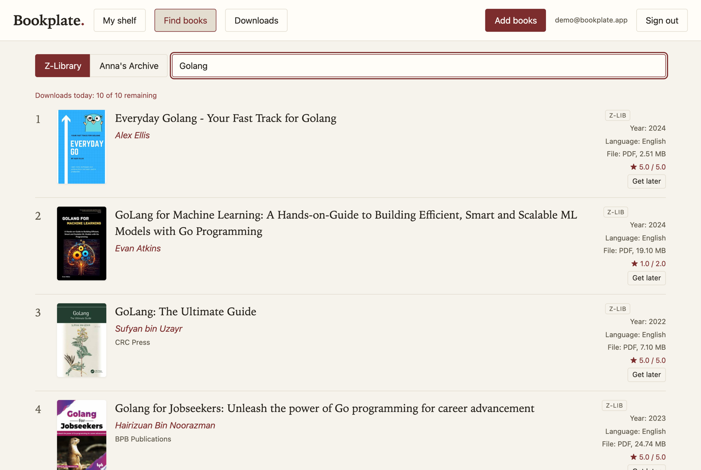

# Bookplate — self-hosted ebook library

Self-hosted multi-user ebook library: upload with auto-metadata, hash dedup,
in-browser reading, z-library search/download (optional), Anna's Archive
search/download (optional, member key), user-to-user sharing,
OPDS for iOS reader apps, AI metadata fallback (optional).





## Features

**Library**
- Upload PDF, EPUB, MOBI, AZW3, FB2, CBZ — drag-and-drop or file picker, sequential
  batch uploads with per-file progress.
- **Automatic metadata**: embedded metadata → filename parsing → Google Books /
  Open Library enrichment → optional AI fallback (any OpenAI-compatible endpoint).
- **Content-addressed storage** (SHA-256): re-uploading the same file dedups
  instantly; a *logical* duplicate (same normalized title + author, different file)
  is flagged so you can compare scans.
- **Guaranteed covers**: real cover art when available, page-1 render for PDFs,
  and a deterministic generated cover as the last resort — every book looks like a
  book on the shelf.
- **Full-text search** (SQLite FTS5) across title, author, categories and ISBN,
  with quoted-phrase support.

**Reading**
- **In-browser reader** (vendored foliate-js): paginated EPUB/MOBI/AZW3/FB2,
  current position remembered per user, mobile-friendly.
- **Download** any book for offline reading; CBZ/PDF open natively where supported.

**Find books (integrations)**
- **Z-Library** via the bundled `zlib` CLI: search, results with covers/ratings/
  year/language/file size, and one-click *Get later* into the download queue.
  Auto-login from your account, automatic session renewal, configurable mirror.
- **Anna's Archive**: search (member key) and downloads that work both for members
  (fast API path) and free accounts (automatic slow partner-server fallback with
  waitlist handling).
- **Download queue**: shared, sequential, quota-aware. It respects the Z-Library
  daily limit (waits and re-checks when exhausted), retries transient failures with
  backoff (3 attempts, 5/30 min), and survives restarts (jobs resume).
  See progress per job; retry or cancel from the UI.

**Users & admin**
- Multi-user with roles: **admin** and **user**.
- **First registered account becomes the admin**; `ADMIN_EMAIL` env overrides which
  account is promoted.
- **Registration control**: open-with-approval (default) or closed. Pending accounts
  can't sign in until an admin approves them in **Admin → Users**.
- Admin can create accounts, approve/enable/disable, change roles, reset passwords.
  The last active admin can't be demoted or disabled.
- **Per-user shelf**: users only see books they uploaded or that were shared with
  them; sharing is per user.
- All users share one Z-Library account and its daily download quota (FIFO queue).

**Admin panel** (in-app, admin only)
- **Users**: create, approve, enable/disable, set role, reset password.
- **Settings** (DB-backed, env fallback): Z-Library account + mirror, Anna's Archive
  key + mirror, AI assist (enable/key/base/model), registration mode. Secrets are
  stored in the database (same trust boundary as `.env.local`) and masked in the API.
- **Z-Library**: daily quota, the account's **download history** (one-click re-queue),
  and the account's **saved books** (My library). Booklists are not exposed by
  z-lib's API and show as unavailable.

**Ops**
- Single container, one volume (`/app/data`) holds everything — DB, books, covers.
- Multi-arch image (amd64 + arm64), checksum-verified `zlib` CLI baked in.
- OPDS 1.2 catalog for iOS reader apps (basic auth).
- No build step: vanilla-JS frontend, vendored foliate-js.

## Deploy with Docker

Multi-arch image (`linux/amd64` + `linux/arm64`) published to GHCR by CI on every push to
`main` and every `v*` tag. Docker picks the right variant automatically — x86-64 servers,
Apple Silicon, Raspberry Pi 4/5 and ARM NAS all just `docker pull`.

```bash
# quick start
docker run -d --name bookplate -p 8480:8480 -v bookplate-data:/app/data \
  ghcr.io/bacnh85/bookplate:latest

# or with compose (recommended)
docker compose up -d
# then open http://localhost:8480
```

All state lives in the mounted volume (`/app/data` inside the container): SQLite DB,
book files, covers. Back up = copy that volume. To move an existing local-dev install,
stop the server and copy the whole local `data/` dir into the volume — with compose
(named volume `bookplate-data`) one way:

```bash
docker run --rm -v bookplate-data:/dest -v "$PWD/data":/src:ro alpine sh -c 'cp -a /src/. /dest/ && chown -R 1000:1000 /dest'
```

The `chown` matters: `cp -a` keeps the source uid (501 on macOS, your uid on Linux) but
the container runs as uid 1000 — without it the migrated DB is unwritable and the
container crash-loops.

### Image tags

| Tag | What |
|---|---|
| `latest` | newest build from `main` |
| `main` | current `main` (same as `latest`) |
| `1.2.3`, `1.2` | release builds (`git tag v1.2.3 && git push --tags`) |
| `sha-<commit>` | exact commit a running container came from |

### Configuration

Configuration lives in **Admin → Settings** (app-managed, stored in `data/ebook.db`) and
falls back to the env vars below when a field is empty — so env-only deployments keep
working, and a value saved in the UI takes over until cleared (the UI's "clear" link
reverts to env). Secrets are masked in reads and never echoed back.

Optional env keys (seeding/fallback):

- `ADMIN_EMAIL` — on startup, promote this account to admin (after the auto-promotion
  rule below picks the earliest active account).
- `ZAI_API_KEY` (+ optional `ZAI_BASE_URL` / `ZAI_MODEL`) — AI metadata fallback.
  `ZAI_ENABLED=0` (or the Settings toggle) turns it off.
- `ZLIB_EMAIL` / `ZLIB_PASSWORD` — Z-Library search/download. The `zlib` CLI is baked
  into the image; with credentials set it auto-logs-in on demand and re-logins if a
  session expires (the session is per-container and re-establishes after restarts).
  Mirror rotting? Set `ZLIB_DOMAIN` (`zlib doctor --eapi` lists healthy mirrors).
- `ANNAS_ARCHIVE_SECRET_KEY` — Anna's Archive search/download. This is the member
  secret key from your AA account page; it both authenticates the site (search) and
  authorizes fast downloads. Mirror rotting? Set `ANNAS_BASE_URL`
  (default `https://annas-archive.gd`). See the Anna's Archive section below.

### Users, roles & admin bootstrap

- The **first account ever created becomes the admin** — on a fresh system just
  register through the normal form.
- On upgrade, if no admin exists, the **earliest active account** is promoted at
  startup; `ADMIN_EMAIL` overrides that choice. Accounts disabled before the upgrade
  are never promoted.
- Registration defaults to **approval required**: new signups land as *pending*, can't
  log in, and appear in Admin → Users for approval. Admin → Settings can switch
  registration to **closed**.
- Admins manage accounts in Admin → Users: approve/enable/disable, set role, reset
  password. The last active admin can't be demoted or disabled (409).
- All users share the one Z-Library account's daily download limit (single queue,
  first-come-first-served).

### Z-Library admin (Admin → Z-Library)

Quota display, the account's **download history** (one click re-queues any item), and
**My library** (`/eapi/user/book/saved`) — admin-only. **Booklists are not exposed by
z-lib's API** (the endpoint doesn't exist in the EAPI surface; tracked upstream at
heartleo/zlib) and show as unavailable.

### Notes

- The server is plain HTTP — put a TLS reverse proxy (e.g. Caddy) in front for anything
  beyond a trusted LAN (OPDS/reader apps use basic auth).
- Healthcheck is built into the image; `docker ps` shows `healthy` once up.
- Prefer the named volume (compose default). Bind-mounting a host dir instead? On
  Linux, pre-create it with the right owner or the container (uid 1000) can't write:
  `mkdir -p data && sudo chown 1000:1000 data`
- Pulling from a private package? `docker login ghcr.io` with a GitHub PAT (read:packages),
  or flip the package to public in the GitHub UI (Package settings → visibility).

## Local development (macOS)

```bash
python3 -m venv .venv && .venv/bin/pip install -r requirements.txt
scripts/serve.sh &                      # binds 127.0.0.1:8480 (keepalive, auto-restarts)
HOST=0.0.0.0 scripts/serve.sh &         # or LAN-exposed for iPhone/iPad testing
# open http://localhost:8480
# stop:  kill $(cat data/serve.pid)
```

`scripts/serve.sh` must be started from a Terminal context: macOS TCC denies
launchd-spawned processes access to `/Volumes`, so a LaunchAgent cannot run this
repo (verified: launchd children get `getcwd: Operation not permitted`). After a
reboot, start it again — or ask the agent to.

⚠️ The server is plain HTTP. On `HOST=0.0.0.0` — including OPDS basic auth —
credentials cross the LAN in cleartext; fine for a trusted home LAN, use a TLS
reverse proxy (e.g. Caddy) for anything wider.

## Data (migration-ready)

All state lives in `data/` (gitignored): `ebook.db` (+WAL), content-addressed
`books/`, `covers/`, `tmp/`. To migrate to a remote server later, Docker-mount
this one folder as a volume — nothing else needs copying. `.env.local` is
gitignored too; recreate provider keys there on the target host.

## Optional env (`.env.local` — loaded by `serve.sh` at startup)

| Var | Purpose |
|---|---|
| `ZLIB_EMAIL` / `ZLIB_PASSWORD` | Your Z-Library account — used to auto-login the `zlib` CLI when no session exists or one expires |
| `ZLIB_DOMAIN` | Override the auto-login mirror (default `https://z-lib.gd`); check healthy mirrors with `zlib doctor --eapi` |
| `ANNAS_ARCHIVE_SECRET_KEY` | Your Anna's Archive account secret key (account page) — required for both search and download |
| `ANNAS_BASE_URL` | Override the Anna's Archive mirror (default `https://annas-archive.gd`) |
| `ZAI_API_KEY` | AI metadata fallback for garbage files (any OpenAI-compatible provider) |
| `ZAI_BASE_URL` / `ZAI_MODEL` | Defaults: `https://api.z.ai/api/openai/v1`, `glm-5.3-flash` |

Z-Library uses the `zlib` CLI (EAPI mobile-app API, auto-solves the DiamWall
proof-of-work that walls raw HTTP clients). One-time setup:

```bash
brew install heartleo/tap/zlib
zlib doctor --eapi                        # pick a 'healthy' domain (e.g. z-lib.gd)
zlib login --eapi --email you@x --password ... --domain https://z-lib.gd
```

### Anna's Archive (member key + free slow downloads)

Anna's Archive has one official member API — fast downloads — and no search API:
search scrapes the site's HTML with your key's session (which also skips the
DDoS-Guard bot check that anonymous visitors get). Downloads use the guard-exempt
`/dyn/api/fast_download.json` endpoint.

Downloads work with OR without a membership:

- **Member account** → instant fast downloads via the official API.
- **Free account** → the app automatically falls back to AA's free "slow partner
  servers" (the same ones the website offers). One is usually immediate; others
  have a waitlist of up to ~10 minutes that the queue waits out for you. No
  membership needed — no account is even required for this path.

Practical notes:

- The secret key authenticates search; it is stored in **Admin → Settings** (or
  the `ANNAS_ARCHIVE_SECRET_KEY` env fallback), never in git; the derived session
  cookie is kept in server RAM only.
- DDoS-Guard decisions are per-IP: if your server's IP is flagged, search (and
  the slow-download pages) get a bot check the server can't pass. Fix: open the
  mirror in a normal browser **on the same network** and complete the checkbox
  once — the clearance is IP-wide; member fast downloads are unaffected by the guard.
- AA rotates domains; if the default mirror dies, point `ANNAS_BASE_URL` at a
  current one (mirrors are listed on the AA site/FAQ).

Add keys via **Admin → Settings** (or `.env.local` for local dev), no restart
needed for settings saved in the UI.

## Test

```bash
.venv/bin/python scripts/selftest.py      # e2e checks against a running server
.venv/bin/python scripts/test_admin.py    # settings + roles/approval (offline)
.venv/bin/python scripts/test_zlib.py     # z-lib adapter + EAPI probe (offline)
.venv/bin/python scripts/test_annas.py    # Anna's Archive adapter (offline)
```

The e2e suite runs two ways: on a **fresh database** (CI) the first registered
user is the admin and the suite approves its own second user; on a **populated
server** set `SELFTEST_ADMIN_EMAIL` / `SELFTEST_ADMIN_PASS` to an existing admin
so the suite can approve its test users.

## iPhone / iPad

- Browser: works in Safari (reader, upload, search).
- Native reader apps (KyBook 3, MapleRead, Yomu): add OPDS catalog
  `http://<host>:8480/opds` with your email + password (HTTP basic auth —
  cleartext over plain HTTP, see the warning above).

## Layout

- `app/` — FastAPI: `db.py` (SQLite+FTS5, migrations), `auth.py` (JWT + roles),
  `settings.py` (DB-backed settings with env fallback), `storage.py` (SHA-256 store),
  `metadata.py` (extraction chain), `ai.py`, `zlib_client.py`, `zlib_eapi.py`
  (z-lib admin: history/library), `annas_client.py`,
  `webfetch.py` (SSRF-pinned fetches), `opds.py`, `main.py`
- `web/` — vanilla JS SPA + vendored `foliate-js` (no build step)
- `scripts/` — `serve.sh` (local keepalive server), e2e + unit test suites
- `docs/images/` — README screenshots
- `data/` — SQLite DB, content-addressed book files, covers (gitignored)
