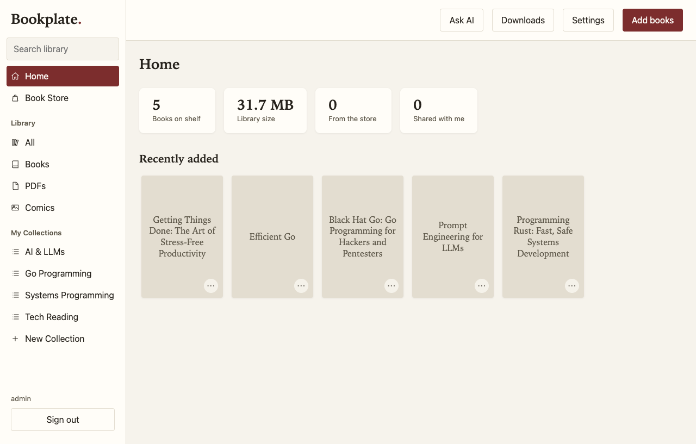
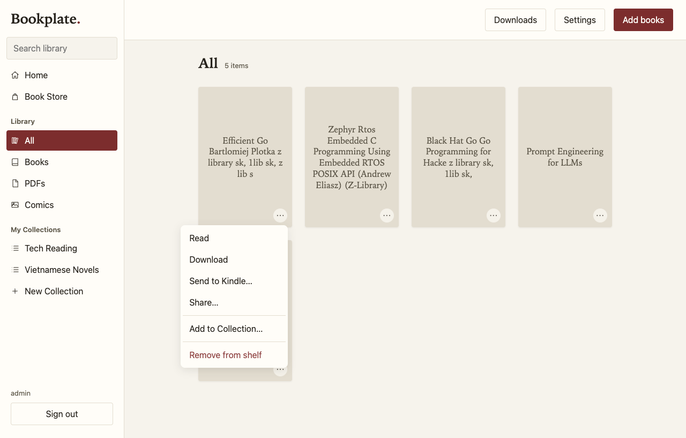
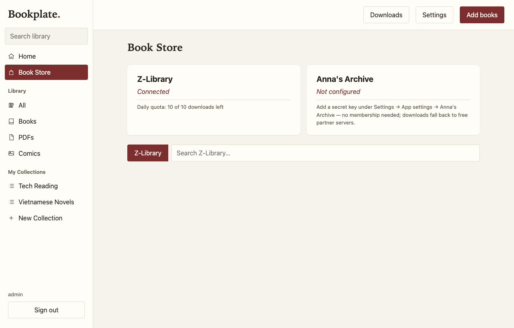
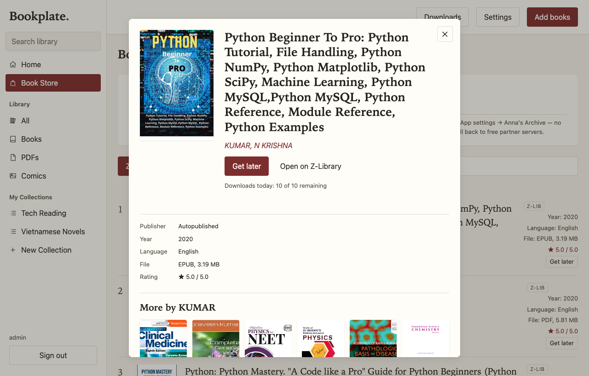
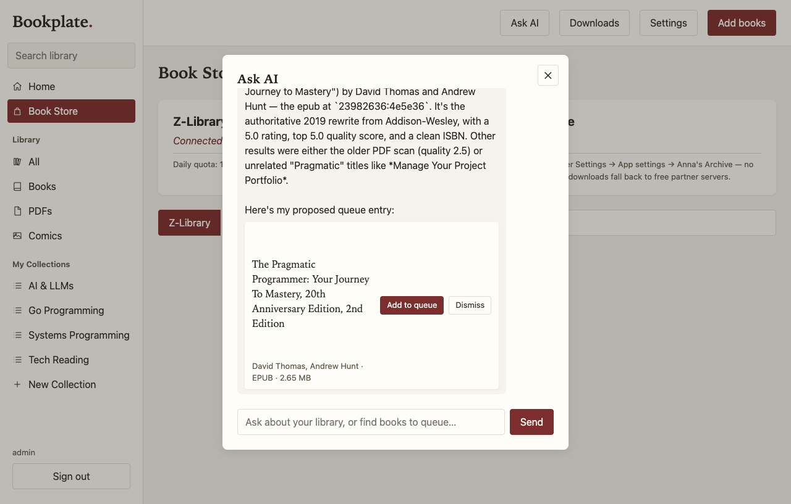
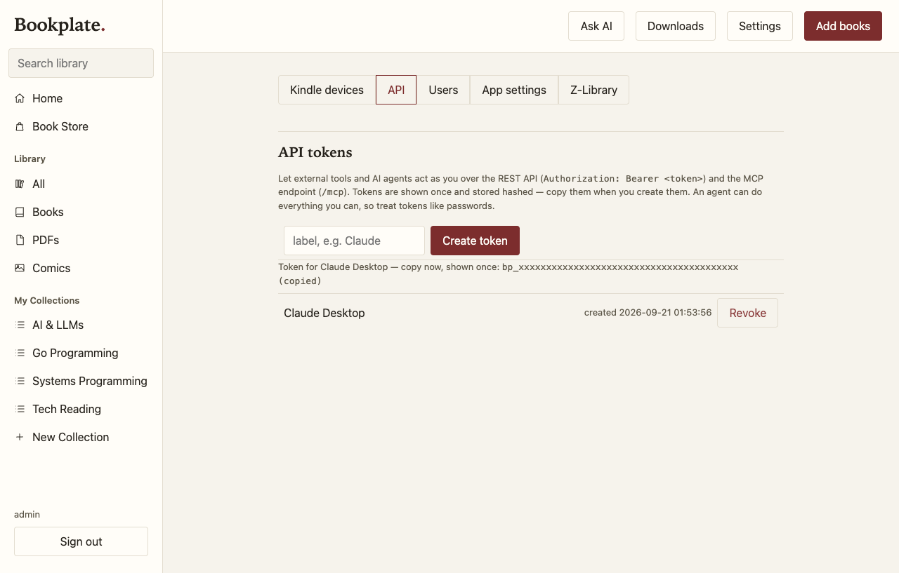

# Bookplate — self-hosted ebook library

Self-hosted multi-user ebook library: upload with auto-metadata, hash dedup,
in-browser reading, z-library search/download (optional), Anna's Archive
search/download (optional, member key), user-to-user sharing,
OPDS for iOS reader apps, AI metadata fallback (optional).











## Features

**Interface**
- Apple Books–style UI: sidebar navigation (Home, Book Store, Library filters,
  My Collections), 3D book tiles — full-bleed cover art on an edge-matched case
  with a slim spine and soft shadow — and a Home page with library stats,
  Continue reading and Recently added. Under each cover: your progress (or a
  NEW badge) plus a `⋯` menu (Read, Download, Send to Kindle, Share,
  Add to Collection, Remove).
- **Reading progress, synced**: the reader saves your position (epub CFI +
  percent) to the server as you read; tiles show your place (3% / Finished / NEW),
  resume works across devices and browsers (newest position wins), and Home's
  Continue reading follows you anywhere.
- **My Collections**: create your own collections in the sidebar and file any
  book on your shelf — including ones shared with you — into them.
- **Ask AI** (optional): a chat that knows your shelf. Ask it to find books
  (it searches the configured stores and offers one-click *Add to queue*),
  organize your shelf into collections, recommend what to read next, or answer
  "do I have…?" questions. Every action is a confirmation card you apply —
  the AI proposes, you approve. Uses the same OpenAI-compatible endpoint as
  metadata assist (Admin → Settings).

**Library**
- Upload PDF, EPUB, MOBI, AZW3, FB2, CBZ — drag-and-drop or file picker, sequential
  batch uploads with per-file progress.
- **Automatic metadata**: embedded metadata → filename parsing → Google Books /
  Open Library enrichment → optional AI fallback (any OpenAI-compatible endpoint).
- **Fix metadata & thumbnails in place**: ask the AI ("fix book 11's title with
  the hint …") or use the API — re-runs the whole extraction/enrichment chain on
  an existing book, updates search instantly, and re-fetches the cover
  (embedded art → PDF page-1 → Google/OL → deterministic placeholder last resort).
- **Content-addressed storage** (SHA-256): re-uploading the same file dedups
  instantly; a *logical* duplicate (same normalized title + author, different file)
  is flagged so you can compare scans.
- **Guaranteed covers**: real cover art when available, page-1 render for PDFs,
  and a deterministic generated cover as the last resort — every book looks like a
  book on the shelf.
- **Full-text search** (SQLite FTS5) across title, author, categories and ISBN,
  with quoted-phrase support.

**Reading**
- **In-browser reader** (vendored foliate-js): paginated EPUB/MOBI/AZW3/FB2,
  current position remembered per user, mobile-friendly.
- **Download** any book for offline reading; CBZ/PDF open natively where supported.

**Book Store (integrations)**
- Source status cards show at a glance whether Z-Library / Anna's Archive are
  configured (connected account, daily quota) — with setup guidance right on
  the card when they're not.
- **Z-Library** via the bundled `zlib` CLI: search, results with covers/ratings/
  year/language/file size, and one-click *Get later* into the download queue.
  Auto-login from your account, automatic session renewal, configurable mirror.
- **Anna's Archive**: search (member key) and downloads that work both for members
  (fast API path) and free accounts (automatic slow partner-server fallback with
  waitlist handling).
- **Download queue**: shared, sequential, quota-aware. It respects the Z-Library
  daily limit (waits and re-checks when exhausted), retries transient failures with
  backoff (3 attempts, 5/30 min), and survives restarts (jobs resume).
  See progress per job; retry or cancel from the UI.
- **Send to Kindle**: one click on a shelf card emails an EPUB or PDF to your
  Kindle via Amazon's email gateway (any SMTP server — e.g. Gmail with an app
  password). Each user registers their own Kindle devices (label + @kindle.com
  address) under Settings → Kindle devices and picks one per send; the admin
  configures the server-wide SMTP transport once. Add the sender address to
  your Amazon account's "Approved Personal Document E-mail List"; delivery
  then just works on every registered device.

**Users & admin**
- Multi-user with roles: **admin** and **user**. Login is **username + password**.
- **First boot creates the admin account**: username from `BOOKPLATE_ADMIN_USER`
  (default `admin`), password from `BOOKPLATE_ADMIN_PASS` — or generated, printed
  once to the container log and saved to `data/initial_admin_password` (delete it
  after first login).
- **Registration control**: open-with-approval (default) or closed. Pending accounts
  can't sign in until an admin approves them in **Admin → Users**.
- Admin can create accounts, approve/enable/disable, change roles, reset passwords.
  The last active admin can't be demoted or disabled.
- **Per-user shelf**: users only see books they uploaded or that were shared with
  them; sharing is per user.
- All users share one Z-Library account and its daily download quota (FIFO queue).
- **API tokens & MCP**: every user can create personal bearer tokens
  (`bp_…`, hashed at rest, shown once, revocable under Settings → API) that
  unlock the whole REST API for external tools, and an MCP server at `/mcp`
  (streamable HTTP, same token) exposes the library to AI agents: search,
  metadata, collections, store queueing, metadata/cover repair.



**Admin panel** (in-app, admin only)
- **Users**: create, approve, enable/disable, set role, reset password.
- **Settings** (DB-backed, configured entirely in the UI): every user manages their
  own Kindle devices; admins additionally configure Z-Library account + mirror,
  Anna's Archive
  key + mirror, AI assist (enable/key/base/model), Send to Kindle SMTP
  (host/port/security/credentials, sender address), registration mode. Secrets
  are stored in the database (same on-disk trust boundary the old `.env.local` had)
  and masked in the API.
- **Z-Library**: daily quota, the account's **download history** (one-click re-queue),
  and the account's **saved books** (My library). Booklists are not exposed by
  z-lib's API and show as unavailable.

**Ops**
- Single container, one volume (`/app/data`) holds everything — DB, books, covers.
- Multi-arch image (amd64 + arm64), checksum-verified `zlib` CLI baked in.
- OPDS 1.2 catalog for iOS reader apps (basic auth).
- No build step: vanilla-JS frontend, vendored foliate-js.

## Deploy with Docker

Multi-arch image (`linux/amd64` + `linux/arm64`) published to GHCR by CI on every push to
`main` and every `v*` tag. Docker picks the right variant automatically — x86-64 servers,
Apple Silicon, Raspberry Pi 4/5 and ARM NAS all just `docker pull`.

```bash
# quick start
docker run -d --name bookplate -p 8480:8480 -v bookplate-data:/app/data \
  ghcr.io/bacnh85/bookplate:latest

# or with compose (recommended)
docker compose up -d
# then open http://localhost:8480
```

All state lives in the mounted volume (`/app/data` inside the container): SQLite DB,
book files, covers. Back up = copy that volume. To move an existing local-dev install,
stop the server and copy the whole local `data/` dir into the volume — with compose
(named volume `bookplate-data`) one way:

```bash
docker run --rm -v bookplate-data:/dest -v "$PWD/data":/src:ro alpine sh -c 'cp -a /src/. /dest/ && chown -R 1000:1000 /dest'
```

The `chown` matters: `cp -a` keeps the source uid (501 on macOS, your uid on Linux) but
the container runs as uid 1000 — without it the migrated DB is unwritable and the
container crash-loops.

### Image tags

| Tag | What |
|---|---|
| `latest` | newest build from `main` |
| `main` | current `main` (same as `latest`) |
| `1.2.3`, `1.2` | release builds (`git tag v1.2.3 && git push --tags`) |
| `sha-<commit>` | exact commit a running container came from |

### Configuration

Everything is configured in the app — **no provider env vars, no `.env.local`**.
After first boot, sign in as the admin and set the Z-Library account, Anna's Archive
key and AI key under **Admin → Settings**. Values live in `data/ebook.db` (masked in
reads, never echoed back; the "clear" link empties a field).

The only optional env keys are the admin bootstrap (see below) and the infra-level
`BOOKPLATE_DATA_DIR` (where the data volume is mounted).

### First boot & admin bootstrap

On an **empty** users table the app creates the admin account itself:

- `BOOKPLATE_ADMIN_USER` — username (default `admin`).
- `BOOKPLATE_ADMIN_PASS` — password. If unset, one is **generated**: printed once to
  the container log (`docker logs bookplate`) and saved to
  `data/initial_admin_password` (mode 0600). Read it, sign in, then delete the file.

Bootstrap runs only while the users table is empty — it never touches existing
accounts. Already deployed? Existing users keep working; the column rename
(`email` → `username`) is automatic and email-shaped usernames keep working.
Legacy provider env vars (`ZLIB_*`, `ANNAS_*`, `ZAI_*`) are imported into the
settings table **once** on the first boot after upgrading (only keys never set
in the UI); after that env is ignored entirely.

### Users, roles & registration
- Registration defaults to **approval required**: new signups land as *pending*, can't
  log in, and appear in Admin → Users for approval. Admin → Settings can switch
  registration to **closed**.
- Admins manage accounts in Admin → Users: approve/enable/disable, set role, reset
  password. The last active admin can't be demoted or disabled (409).
- All users share the one Z-Library account's daily download limit (single queue,
  first-come-first-served).

### Z-Library admin (Admin → Z-Library)

Quota display, the account's **download history** (one click re-queues any item), and
**My library** (`/eapi/user/book/saved`) — admin-only. **Booklists are not exposed by
z-lib's API** (the endpoint doesn't exist in the EAPI surface; tracked upstream at
heartleo/zlib) and show as unavailable.

### Notes

- The server is plain HTTP — put a TLS reverse proxy (e.g. Caddy) in front for anything
  beyond a trusted LAN (OPDS/reader apps use basic auth).
- Healthcheck is built into the image; `docker ps` shows `healthy` once up.
- Prefer the named volume (compose default). Bind-mounting a host dir instead? On
  Linux, pre-create it with the right owner or the container (uid 1000) can't write:
  `mkdir -p data && sudo chown 1000:1000 data`
- Pulling from a private package? `docker login ghcr.io` with a GitHub PAT (read:packages),
  or flip the package to public in the GitHub UI (Package settings → visibility).

## Local development (macOS)

```bash
python3 -m venv .venv && .venv/bin/pip install -r requirements.txt
scripts/serve.sh &                      # binds 127.0.0.1:8480 (keepalive, auto-restarts)
HOST=0.0.0.0 scripts/serve.sh &         # or LAN-exposed for iPhone/iPad testing
# open http://localhost:8480
# stop:  kill $(cat data/serve.pid)
```

`scripts/serve.sh` must be started from a Terminal context: macOS TCC denies
launchd-spawned processes access to `/Volumes`, so a LaunchAgent cannot run this
repo (verified: launchd children get `getcwd: Operation not permitted`). After a
reboot, start it again — or ask the agent to.

⚠️ The server is plain HTTP. On `HOST=0.0.0.0` — including OPDS basic auth —
credentials cross the LAN in cleartext; fine for a trusted home LAN, use a TLS
reverse proxy (e.g. Caddy) for anything wider.

## Data (migration-ready)

All state lives in `data/` (gitignored): `ebook.db` (+WAL), content-addressed
`books/`, `covers/`, `tmp/`. To migrate to a remote server later, Docker-mount
this one folder as a volume — nothing else needs copying.

### Optional env

| Var | Purpose |
|---|---|
| `BOOKPLATE_ADMIN_USER` | Bootstrap admin username (default `admin`) — only used while the users table is empty |
| `BOOKPLATE_ADMIN_PASS` | Bootstrap admin password — if unset, generated (logged + `data/initial_admin_password`) |
| `BOOKPLATE_DATA_DIR` | Data directory override (tests, non-default volume mounts) |

Z-Library / Anna's Archive / AI keys are set in **Admin → Settings** after first
login, no restart needed. Z-Library uses the `zlib` CLI (EAPI mobile-app API,
auto-solves the DiamWall proof-of-work that walls raw HTTP clients); the app
auto-logins from the configured account and re-logins when a session expires.

```bash
brew install heartleo/tap/zlib
zlib doctor --eapi                        # pick a 'healthy' domain (e.g. z-lib.gd)
zlib login --eapi --email you@x --password ... --domain https://z-lib.gd
```

### Anna's Archive (member key + free slow downloads)

Anna's Archive has one official member API — fast downloads — and no search API:
search scrapes the site's HTML with your key's session (which also skips the
DDoS-Guard bot check that anonymous visitors get). Downloads use the guard-exempt
`/dyn/api/fast_download.json` endpoint.

Downloads work with OR without a membership:

- **Member account** → instant fast downloads via the official API.
- **Free account** → the app automatically falls back to AA's free "slow partner
  servers" (the same ones the website offers). One is usually immediate; others
  have a waitlist of up to ~10 minutes that the queue waits out for you. No
  membership needed — no account is even required for this path.

Practical notes:

- The secret key authenticates search; it is stored in **Admin → Settings**, never
  in git; the derived session
  cookie is kept in server RAM only.
- DDoS-Guard decisions are per-IP: if your server's IP is flagged, search (and
  the slow-download pages) get a bot check the server can't pass. Fix: open the
  mirror in a normal browser **on the same network** and complete the checkbox
  once — the clearance is IP-wide; member fast downloads are unaffected by the guard.
- AA rotates domains; if the default mirror dies, point `ANNAS_BASE_URL` at a
  current one (mirrors are listed on the AA site/FAQ).

Add keys via **Admin → Settings** — no restart needed.

## Test

```bash
.venv/bin/python scripts/selftest.py      # e2e checks against a running server
.venv/bin/python scripts/test_admin.py    # settings + roles/approval (offline)
.venv/bin/python scripts/test_ai.py       # AI chat: tool loop, actions parser (offline)
.venv/bin/python scripts/test_tokens.py   # API tokens + bearer auth (offline)
.venv/bin/python scripts/test_mcp.py      # MCP server round-trip (live local server)
node scripts/test_ai_ui.mjs               # AI action cards (behavioral, no browser)
.venv/bin/python scripts/test_zlib.py     # z-lib adapter + EAPI probe (offline)
.venv/bin/python scripts/test_annas.py    # Anna's Archive adapter (offline)
```

The e2e suite runs two ways: on a **fresh database** (CI) it signs in with the
bootstrap admin (pass `BOOKPLATE_ADMIN_PASS` to the container, or let the runner
read `data/initial_admin_password`); on a **populated
server** set `SELFTEST_ADMIN_USER` / `SELFTEST_ADMIN_PASS` to an existing admin
so the suite can approve its test users. In both modes registrations land as
*pending* and the suite approves them via the admin API.

## iPhone / iPad

- Browser: works in Safari (reader, upload, search).
- Native reader apps (KyBook 3, MapleRead, Yomu): add OPDS catalog
  `http://<host>:8480/opds` with your username + password (HTTP basic auth —
  cleartext over plain HTTP, see the warning above).

## Layout

- `app/` — FastAPI: `db.py` (SQLite+FTS5, migrations), `auth.py` (JWT + roles),
  `settings.py` (DB-backed settings), `storage.py` (SHA-256 store),
  `metadata.py` (extraction chain), `ai.py`, `zlib_client.py`, `zlib_eapi.py`
  (z-lib admin: history/library), `annas_client.py`,
  `webfetch.py` (SSRF-pinned fetches), `opds.py`, `main.py`
- `web/` — vanilla JS SPA + vendored `foliate-js` (no build step)
- `scripts/` — `serve.sh` (local keepalive server), e2e + unit test suites,
  `capture_shots.py` (regenerates the README screenshots above; needs a running
  server + local Chrome)
- `docs/images/` — README screenshots
- `data/` — SQLite DB, content-addressed book files, covers (gitignored)
